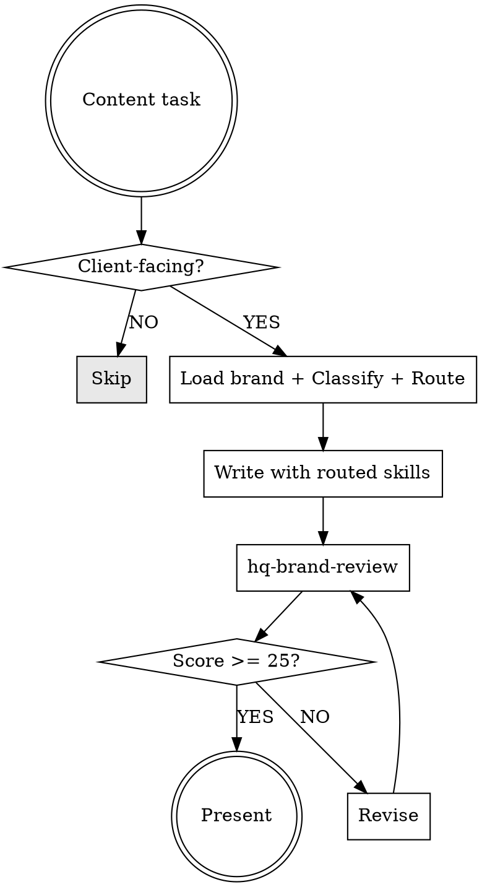

# HQ Content Enforcer -- Mandatory Content Quality Gate

## File Index

| File | Load When | Do NOT Load |
|------|-----------|-------------|
| `references/brand-quick-ref.md` | Every content task (voice attributes, banned terms, tone targets) | Never skip -- this IS the brand standard |
| `references/content-routing-guide.md` | Every content task (maps content type to required skills and docs) | Never skip -- this IS the routing logic |
| `<workforce-hq-cwd>/knowledge-base/governance/voice-profile-chris.md` | Content authored AS CHRIS (from solutions@ to clients): cold-email, email-sequence, copywriting from-Chris, proposal/SOW signed by Chris, sales script | Generic Sharkitect copy not bylined as Chris (landing pages, marketing site, social posts), client's voice work, internal docs |

## Scope Boundary

| IN SCOPE | OUT OF SCOPE | Use Instead |
|----------|-------------|-------------|
| Orchestrating skill invocation for content tasks | Actually writing the content | The routed skills handle writing |
| Loading brand voice requirements before writing | Brand compliance scoring after writing | `hq-brand-review` skill |
| Routing to correct CRO/SEO/copywriting skills | General copywriting without HQ brand context | `copywriting` skill directly |
| Enforcing pre-production checklist | Content strategy and editorial planning | `content-strategist` agent |
| Ensuring brand review runs before completion | Visual design or UI feedback | `ui-ux-designer` agent |

## The Enforcement Protocol

**Sequence:** Load brand voice -> Classify content type -> Route to skills (see `references/content-routing-guide.md`) -> Create checklist -> Write with skills -> Brand review -> Revise if <25 -> Present



## Content Type Routing

The full routing decision tree with all skill combinations lives in `references/content-routing-guide.md`. Load it every time -- it's the authoritative source for which skills to invoke per content type.

**Quick reference** (for classification only -- use the companion for exact skill stacks):

| Content Type | Identification Signals |
|---|---|
| **Landing page / website copy** | URL destination, hero section, CTA, conversion goal |
| **Email (cold/outreach)** | First contact, prospecting, no prior relationship |
| **Email (nurture/sequence)** | Multi-touch, drip, follow-up, existing lead |
| **Form / signup flow** | Input fields, registration, lead capture |
| **Proposal / SOW** | Client deliverable, pricing, scope, timeline |
| **Social post** | Platform-native (LinkedIn, X, Instagram) |
| **Blog / article** | Educational, SEO-targeted, thought leadership |
| **Presentation** | Slides, pitch deck, keynote |
| **Ad copy** | Paid media, Google Ads, social ads |
| **Case study** | Client success story, results showcase |
| **Sales script** | Call script, demo script, objection handling |

**If ambiguous:** default to `copywriting` + `hq-brand-review` as minimum. Add CRO/SEO skills if there is ANY conversion or search intent.

## Why Specific Skills Are Paired (Expert Rationale)

The routing table isn't arbitrary. Each pairing exists because different content types operate on different psychological and conversion mechanisms:

- **Landing pages require `page-cro` + `seo-optimizer`**: A landing page has two masters -- search engines (discovery) and human visitors (conversion). SEO gets the page found; CRO converts the visitor. Using `copywriting` alone produces persuasive text that nobody finds, or found text that nobody acts on. The skills must stack because optimizing for one without the other produces a page that fails at half its job.

- **Cold emails require `cold-email` + `outreach-specialist`, NOT `copywriting`**: Cold email and marketing copy are fundamentally different disciplines. Marketing copy assumes the reader chose to be there. Cold email must earn attention from someone who didn't ask to hear from you. `copywriting` optimizes for persuasion; `cold-email` optimizes for reply rate. The deliverability rules alone (avoiding spam triggers, domain reputation, send volume) are a separate domain that `copywriting` doesn't cover.

- **Proposals require `writing-clearly-and-concisely`, NOT just `copywriting`**: Proposals are evaluated by decision-makers scanning for risk signals. Persuasive writing in a proposal triggers skepticism -- it reads like a sales pitch when the reader wants evidence. `writing-clearly-and-concisely` produces the precision and structure that builds trust at the decision stage. Combined with `copywriting` for the executive summary and value framing, the two skills cover both the emotional and analytical evaluation paths.

- **Ad copy requires `marketing-psychology`**: Ads operate in 3-7 seconds of attention. Standard copywriting produces clear, brand-consistent text. But ads need specific psychological triggers -- loss aversion for retargeting, social proof for cold audiences, anchoring for pricing ads. These are distinct from general persuasion and have measurable impact on CTR and conversion rate.

- **Forms require `form-cro` + `signup-flow-cro`**: Every form field is a friction point with measurable abandonment rates. A 5-field form converts ~20% better than a 7-field form (Formstack research). The CRO skills encode field-ordering psychology, progressive disclosure patterns, and micro-copy optimization that `copywriting` doesn't address because form UX is a conversion engineering discipline, not a writing discipline.

## Worked Example: Landing Page Hero Rewrite

```
User: "Rewrite the hero section on our landing page"

1. INVOKE hq-content-enforcer (this skill)
2. LOAD brand-quick-ref.md -> voice: Confident 7-9, Direct 7-9, Action-Oriented 7-9
3. CLASSIFY: Landing page (URL destination, hero section, CTA)
4. LOAD content-routing-guide.md -> Required: copywriting + page-cro + seo-optimizer + hq-brand-review
5. INVOKE page-cro -> hero needs single clear CTA above fold, benefit-first headline
6. INVOKE seo-optimizer -> primary keyword in H1, meta description alignment
7. INVOKE copywriting -> draft hero with all loaded context:
   - Headline: benefit-first, confident, no hedge words
   - Subhead: specific outcome ("15 minutes instead of 4 hours")
   - CTA: imperative mood ("Schedule Your Diagnostic" not "Learn More")
8. INVOKE hq-brand-review -> score voice attributes, scan banned terms
9. Score 27/30 (Brand-Clear) -> present to user
   (If 18: revise flagged items -> re-review -> present when >= 25)
```

## Pre-Production Checklist (Create via TodoWrite)

After classifying the content type and identifying required skills, create this checklist:

- [ ] Brand voice loaded (brand-quick-ref.md read and understood)
- [ ] If from-Chris client content: voice-profile-chris.md loaded (knowledge-base/governance/voice-profile-chris.md from workforce-hq cwd) and applied to content-type-specific voice equation
- [ ] Content type classified: [TYPE]
- [ ] Author identity: [Chris / Sharkitect / Client voice]
- [ ] Required skills identified: [LIST]
- [ ] Additional KB docs loaded if needed (pricing, services, etc.)
- [ ] All required skills invoked before writing
- [ ] Content written following skill guidance
- [ ] `hq-brand-review` invoked on final output
- [ ] Brand score: [SCORE] / Determination: [CLEAR/ALIGNED/REVISION/ESCALATION]
- [ ] For from-Chris content, voice fidelity check: does it sound like Chris reading it back? (greeting/closing/cadence match voice profile)
- [ ] If Revision Required: changes made and re-reviewed

## Anti-Patterns

1. **Writing First, Enforcing Later**: Starting to write content before invoking this skill and loading brand voice. By the time you realize the content is off-brand, you've committed 500+ tokens to text that needs rewriting. Load brand voice FIRST, write SECOND. The 30 seconds to load the guide saves 5 minutes of revision.

2. **Skipping CRO for "Simple" Pages**: Every client-facing page has a conversion goal, even if it's just "keep reading." A contact form without `form-cro` guidance converts 20-40% worse than one built with CRO patterns. No page is too simple for conversion optimization.

3. **Brand Review as Optional**: Treating `hq-brand-review` as a nice-to-have instead of a mandatory gate. AI-generated content introduces an average of 3-5 banned patterns per 500 words (hedge words, filler transitions, enthusiasm inflation). The review catches what you cannot see in your own output.

4. **Using Generic Copywriting for Everything**: The `copywriting` skill optimizes for persuasion. API docs need `documentation-templates`. Technical proposals need `writing-clearly-and-concisely`. Emails need `cold-email` or `email-sequence`. Using the wrong skill produces content that reads well but serves the wrong purpose.

5. **Forgetting Pricing/Service Docs for Proposals**: Proposals and SOWs that don't reference `pricing-structure.md` and `service-definitions.md` risk quoting wrong prices, using outdated service names, or missing required scope items. These docs change -- always load the current version.

6. **One-Shot Content Without Iteration**: Writing content in a single pass and presenting it as final. Professional content goes through: draft (with skills) -> brand review -> revision -> re-review. Skipping the revision cycle produces content that scores 15-20 (Revision Required) instead of 25+ (Brand-Clear).

7. **Batch-Skipping for "Efficiency"**: "I'll write all 5 pages first, then brand-review them all at once." Each page has different content types and different skill requirements. Batch-reviewing produces generic feedback. Review each piece individually as it's completed.

8. **Ignoring Channel-Specific Tone**: A LinkedIn post at formality 3/10 and a client proposal at formality 6/10 require different approaches even though both are "content." The brand-quick-ref.md includes tone modulation by channel. Match the channel, not just the brand.

## Edge Cases

**Mixed content (email with embedded landing page link preview):** Treat each component by its own type. The email body follows email skills. The link preview / OG tags follow landing page skills. Score each component independently.

**Content that updates existing copy (not writing from scratch):** Still invoke the enforcer. Existing copy may already be off-brand. Load brand voice, review the existing copy against it, then make changes that move toward compliance -- not just the specific edit requested.

**Urgent content ("just send it, we'll fix it later"):** The enforcer still applies but can be compressed: load brand-quick-ref.md, do a rapid banned-term scan, verify the CTA is clear, and ship. "Later" never comes -- review before sending.

**Content for a different brand (client's brand, not Sharkitect):** This enforcer is for Sharkitect brand only. If writing content in a client's voice, do NOT apply Sharkitect brand rules. Use the client's brand guide if available, or the general `copywriting` skill.